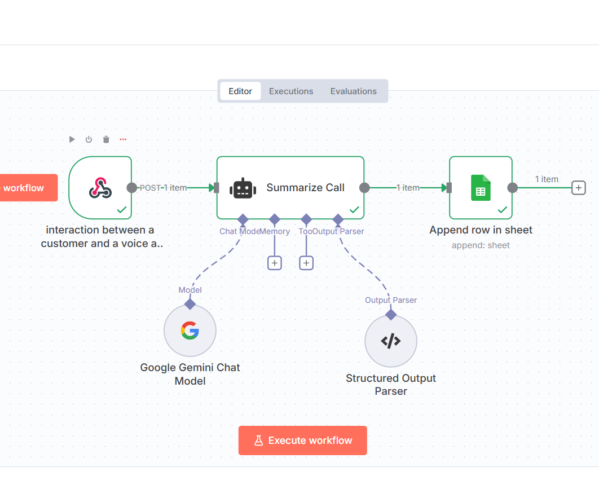

🎙️ AI Voice Agent – Intelligent Call Handling & Appointment Booking System

An advanced AI-powered voice assistant built with Retell, n8n, OpenAI, and Google Calendar.
Handles inbound calls, verifies insurance, books appointments, and updates CRM data — all through natural, human-like conversation.

🌟 Overview

AI Voice Agent is a next-generation automation system designed to simulate a human receptionist.
It answers inbound calls, collects user details, checks insurance eligibility, and books appointments directly using Retell AI.

All booking and call summary data are automatically sent to n8n, which updates your Google Calendar and CRM (Google Sheets).

This project is ideal as both a demo and a deployable solution for real-world businesses such as healthcare clinics, service centers, or customer support operations.

## 🎬 Demo Video  

🎥 **Demo Video**

> *Click the image above to watch the real-time appointment booking demo on Vimeo.*

🎥 Watch the AI Voice Agent handle a real-time appointment booking call with human-like accuracy and tone.

🧠 Features

🎤 Human-like voice interaction — understands and responds naturally.

📞 End-to-end call automation — greeting, booking, confirmation, and closing.

🧾 CRM integration — syncs call data to Google Sheets or any CRM.

📅 Smart scheduling — connects with Google Calendar in real time.

🤖 AI intelligence — powered by OpenAI for conversational understanding.

🕒 Natural language time parsing — interprets “tomorrow at 3 PM,” “next Friday,” etc.

🔁 Adaptable workflow — can scale for clinics, hotels, or customer support lines.

⚙️ Technical Stack
Component	Technology	Purpose
Voice Interface	Retell AI
	Handles natural voice conversations
Workflow Automation	n8n
	Processes and routes call data
AI Model	OpenAI
	Provides conversational intelligence
Calendar Integration	Google Calendar API
	Appointment scheduling
CRM	Google Sheets	Stores call summaries and contacts
Backend	Node.js + Python	Data processing & API handling
🧩 System Architecture
Caller
  ↓
🎙️ Retell AI Agent ("Nabeel")
  ↓
AI collects details & books appointment
  ↓
📡 n8n Workflow (Webhook)
  ↓
🗓️ Google Calendar updated
  ↓
📊 CRM (Google Sheets) updated

🗣️ Voice Agent Details

Name: Nabeel

Persona: Warm, friendly, and professional receptionist

Capabilities:

Books appointments and checks insurance

Answers FAQs and transfers calls

Interprets natural language time

Confirms bookings instantly

Unique Intelligence:

Understands relative time (“tomorrow,” “next Friday”)

Adapts tone based on caller’s intent

Feels like a real human assistant on the phone

🧠 Example Call Flow

Caller: “Hi, I’d like to book an appointment for tomorrow at 3 PM.”
AI (Nabeel): “Sure! I’ve scheduled your appointment for Saturday, November 1st at 3 PM. Please arrive 10 minutes early and bring your insurance card.”

(AI sends details → n8n → Google Calendar + CRM)

🧭 Workflow Summary
Step	Action	Tool
1️⃣	Caller initiates the call	Retell AI
2️⃣	AI understands intent using NLP	OpenAI
3️⃣	Collects name, email, insurance, and time	Retell
4️⃣	Parses date/time to structured format	Python / Node.js
5️⃣	Confirms and books appointment	Google Calendar API
6️⃣	Updates CRM record	n8n + Google Sheets
🛠️ Installation & Setup
1️⃣ Clone the Repository
git clone https://github.com/nabeeljaan1313/ai-voice-agent-retell-n8n.git
cd ai-voice-agent-retell-n8n

2️⃣ Configure Retell AI

Create a new agent in Retell.ai
.

Paste the persona from /retell/prompt.txt.

Set up your webhook to point to your n8n endpoint.

Use variables like {{currentDateTime}}, {{firstName}}, etc.

3️⃣ Configure n8n Workflow

Import /n8n/voice-agent-workflow.json into n8n.

Connect Google Calendar and Google Sheets nodes.

Test with a sample Retell call event.

🔍 Recommended GitHub Topics
retell-ai, n8n, openai, voice-ai, conversational-ai, 
automation, appointment-booking, healthcare-ai,
nodejs, python, google-calendar, crm-integration,
speech-recognition, ai-assistant, portfolio-project

🚀 Future Enhancements

🌐 Multi-language support (English, Spanish, Arabic)

📩 Email or SMS appointment confirmation

🤖 Integration with HubSpot or Salesforce CRM

🗓️ Dynamic calendar selection per department

🧠 AI-powered call summary generation

📄 License

This project is licensed under the MIT License © 2025 @nabeeljaan1313
.

👏 Credits

Developed by: Nabeel Jaan

Powered by: Retell AI
 × n8n
 × OpenAI

Inspiration: Automating real-world healthcare communication through AI-driven voice technology.

🧭 Keywords for GitHub SEO

AI Voice Agent, Retell AI, n8n Workflow, OpenAI Assistant, Appointment Booking Bot, Voice Receptionist, AI Phone Agent, Google Calendar Integration, Conversational AI, Healthcare Automation, Node.js, Python, CRM Workflow, Speech-to-Action Assistant, Portfolio Project
